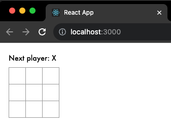

# React TypeScript 시작하기

## 환경 설정

1. 새로운 프로젝트를 생성하기
```shell
npx --yes create-react-app . --template typescript
```


2. src/ 폴더 내의 파일들 삭제하기
```shell
cd my-app
cd src

# Mac 또는 Linux 사용자의 경우
rm -f *

# Windows 사용자
del *

# 다시 프로젝트 폴더로 돌아가세요.
cd ..
```

3. src/ 폴더에 index.css라는 파일을 생성하고 이 CSS 코드를 추가하기
```css
body {
    font: 14px "Century Gothic", Futura, sans-serif;
    margin: 20px;
}

ol, ul {
    padding-left: 30px;
}

.board-row:after {
    clear: both;
    content: "";
    display: table;
}

.status {
    margin-bottom: 10px;
}

.square {
    background: #fff;
    border: 1px solid #999;
    float: left;
    font-size: 24px;
    font-weight: bold;
    line-height: 34px;
    height: 34px;
    margin-right: -1px;
    margin-top: -1px;
    padding: 0;
    text-align: center;
    width: 34px;
}

.square:focus {
    outline: none;
}

.kbd-navigation .square:focus {
    background: #ddd;
}

.game {
    display: flex;
    flex-direction: row;
}

.game-info {
    margin-left: 20px;
}
```

4. src/ 폴더에 index.tsx라는 파일을 생성하고 이 JS 코드를 추가하기

#### index.tsx
```tsx
import React from 'react';
import ReactDOM from 'react-dom/client';
import './index.css';

class Square extends React.Component {
    render() {
        return (
            <button className="square">
                {/* TODO */}
            </button>
        );
    }
}

class Board extends React.Component {
    renderSquare(i: number) {
        return <Square />;
    }

    render() {
        const status = 'Next player: X';

        return (
            <div>
                <div className="status">{status}</div>
                <div className="board-row">
                    {this.renderSquare(0)}
                    {this.renderSquare(1)}
                    {this.renderSquare(2)}
                </div>
                <div className="board-row">
                    {this.renderSquare(3)}
                    {this.renderSquare(4)}
                    {this.renderSquare(5)}
                </div>
                <div className="board-row">
                    {this.renderSquare(6)}
                    {this.renderSquare(7)}
                    {this.renderSquare(8)}
                </div>
            </div>
        );
    }
}

class Game extends React.Component {
    render() {
        return (
            <div className="game">
                <div className="game-board">
                    <Board />
                </div>
                <div className="game-info">
                    <div>{/* status */}</div>
                    <ol>{/* TODO */}</ol>
                </div>
            </div>
        );
    }
}

// ========================================

const root = ReactDOM.createRoot(document.getElementById("root") as HTMLElement) as ReactDOM.Root;
root.render(<Game />);
```

`npm start` 명령어를 실행하고 브라우저에서 [http://localhost:3000](http://localhost:3000)를 열면 비어있는 TicTakTo 필드를 확인할 수 있습니다.




---

## 개요 

이제 설정을 완료했으니 React의 개요를 살펴보자!

### React란?
React는 사용자 인터페이스를 구축하기 위한 선언적이고 효율적이며 유연한 JavaScript 라이브러리다.
“Component”라고 불리는 작고 고립된 코드의 파편을 이용하여 복잡한 UI를 구성하도록 돕는다.

React는 몇 가지 종류의 컴포넌트를 가지지만 우리는 `React.Component`의 하위 클래스를 사용해보겠다.

```tsx
class ShoppingList extends React.Component {
  render() {
    return (
      <div className="shopping-list">
        <h1>Shopping List for {this.props.name}</h1>
        <ul>
          <li>Instagram</li>
          <li>WhatsApp</li>
          <li>Oculus</li>
        </ul>
      </div>
    );
  }
}

// 사용 예제: <ShoppingList name="Mark" />
```
XML과 유사한 재밌는 태그를 사용할 것이다.
우리는 컴포넌트를 사용하여 React에게 화면에 표현하고 싶은 것이 무엇인지 알려준니다. 
데이터가 변경될 때 React는 컴포넌트를 효율적으로 업데이트하고 다시 렌더링한다.

여기에서 ShoppingList는 **React 컴포넌트 클래스** 또는 **React 컴포넌트 타입**입니다.
개별 컴포넌트는 `props`라는 매개변수를 받아오고 `render` 함수를 통해 표시할 뷰 계층 구조를 반환합니다.

`render` 함수는 화면에서 보고자 하는 *내용*을 반환한다. 
React는 설명을 전달받고 결과를 표시한다. 
특히 `render`는 렌더링할 내용을 경량화한 **React 엘리먼트**를 반환합니다. 다수의 React 개발자는 “JSX”라는 특수한 문법을 사용하여 React의 구조를 보다 쉽게 작성한다. 
`<div />` 구문은 빌드하는 시점에서 `React.createElement('div')`로 변환됩니다. 
위에서 본 예시는 아래와 같이 변화한다.

```jsx
return React.createElement('div', {className: 'shopping-list'},
  React.createElement('h1', /* ... h1 children ... */),
  React.createElement('ul', /* ... ul children ... */)
);
```

`createElement()`에 대해 궁금한 점이 있다면 [API 참조](https://ko.legacy.reactjs.org/docs/react-api.html#createelement)에서 자세한 설명을 확인할 수 있다. 
하지만 자습서에서는 이 방식이 아니라 JSX를 계속 사용할 것입니다.

JSX는 JavaScript의 강력한 기능을 가지고 있습니다.
JSX 내부의 중괄호 안에 _어떤_ JavaScript 표현식도 사용할 수 있습니다.
React 엘리먼트는 JavaScript 객체이며 변수에 저장하거나 프로그램 여기저기에 전달할 수 있습니다.

`ShoppingList` 컴포넌트는 `<div />`와 `<li />` 같은 내각 DOM 컴포넌트만을 렌더링하지만 컴포넌트를 조합하여 커스텀 React 컴포넌트를 렌더링하는 것도 가능하다.
예를 들어 <ShoppingList />를 작성하여 모든 쇼핑 목록을 참조할 수 있습니다. React 컴포넌트는 캡슐화되어 독립적으로 동작할 수 있다. 
이러한 이유로 단순한 컴포넌트를 사용하여 복잡한 UI를 구현할 수 있다.

---

### 초기 코드 살펴보기

[`src/index.tsx`](#indextsx)를 열자.

초기 코드는 제작할 틱택토의 기본 틀이다.
CSS 스타일은 제공되기 때문에 React를 배우는 것과 게임을 프로그래밍하는 데에만 집중하면 된다.

코드를 살펴보면 세 가지 React 컴포넌트를 확인 할 수 있다.

- Square

- Board

- Game

Square 컴포넌트는 `<button>`을 렌더링하고 Board는 Square 9개를 렌더링한다.
Game 컴포넌트는 Board를 렌더링하며 나중에 수정할 자리 표시자 값을 가지고 있다. 
지금은 사용자와 상호작용하는 컴포넌트가 없다.

---

### Props를 통해 데이터 전달하기

```tsx
class Board extends React.Component {
  renderSquare(i) {
    return <Square value={i} />;
  }
}
```